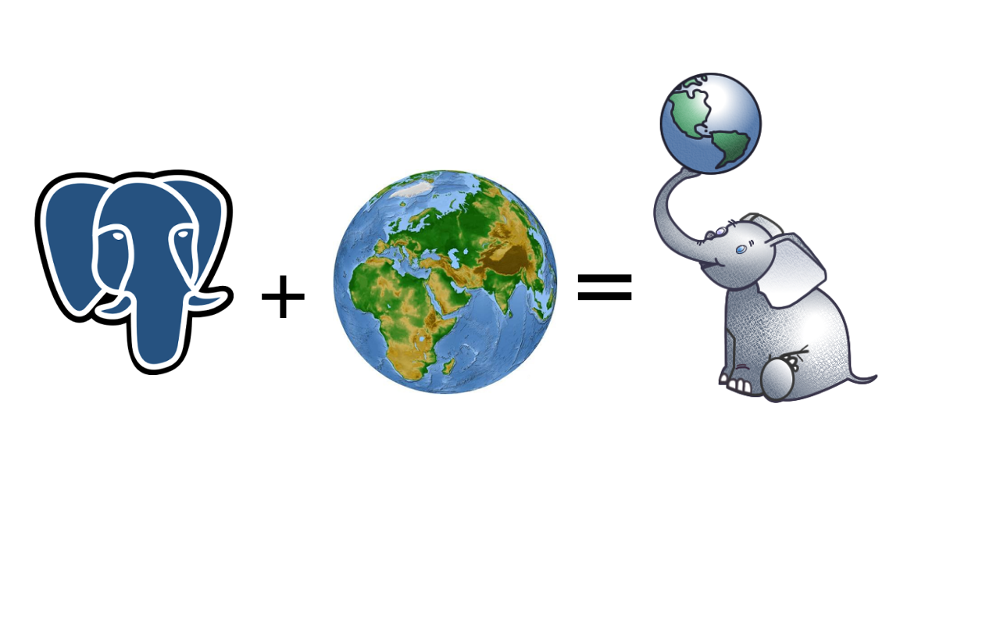

# GIS Programming IV: Introduction to Spatial Databases

## [http://bit.ly/geoinq-postgis](http://bit.ly/geoinq-webmap)

## Details

* Date & hour: October 28th 2017, 11-15h.
* Location: Auditorio, Medialab-Prado Madrid.
* Links: [meetup](https://www.meetup.com/es-ES/preview/Geoinquietos-MAD/events/243363198).
* Instructors:
  * Ramiro Aznar, CARTO.
  * Ernesto Martínez, CARTO.
  * Oriol Boix, CARTO

## Index

1. Introduction to GeoInquietos Madrid [slides]

2. Introduction to PostgreSQL and PostGIS [slides]

3. Working with pgAdmin [workshop]

  * Create a spatial database
  * Import shapefiles
  * Applying spatial queries

4. Working with QGIS [workshop]

  * Connect PostGIS database with QGIS
  * Visualizing spatial queries with QGIS
5. Working with CARTO [workshop]
   * Visualizing spatial queries with CARTO