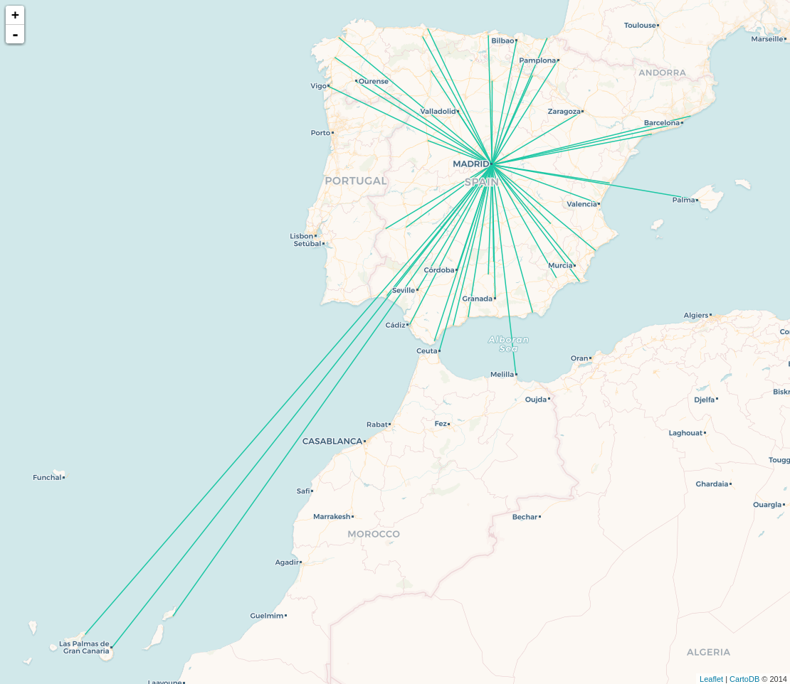

# How to visualize spatial queries with CARTO

1. Go to [CARTO Basic Viewer](http://bit.ly/carto-viewer) application.
2. Copy and paste the following queries within the SQL console and click `CTRL+S`.


## Index

* [Making lines](#lines)
* [Creating areas of influence](#aoi)
* [Getting the closest points](#closest)
* [Intersecting](#intersect)
* [Points within a certain distance](#within)
* [Clipping](#clip)
* [Traslating](#translate)
* [Changing projections](#proj)
* [Great circles](#gc)
* [CARTO spatial functions](#carto)


### Making lines<a name="lines"></a>

```sql
WITH 
  spain as (SELECT * FROM populated_places WHERE adm0name ILIKE 'spain'),
  madrid as (SELECT * FROM spain WHERE name ILIKE 'Madrid')

SELECT
  ST_Transform(ST_MakeLine(m.the_geom, s.the_geom),3857) as the_geom_webmercator,
  s.cartodb_id
FROM
  spain s, madrid m
WHERE
  s.cartodb_id <> m.cartodb_id
```




### Creating areas of influence<a name="aoi"></a>

```sql
WITH 
  spain as (SELECT * FROM populated_places WHERE adm0name ILIKE 'spain'),
  madrid as (SELECT * FROM spain WHERE name ILIKE 'Madrid')

SELECT
  ST_Transform(ST_MakeLine(m.the_geom, s.the_geom),3857) as the_geom_webmercator,
  s.cartodb_id
FROM
  spain s, madrid m
WHERE
  s.cartodb_id <> m.cartodb_id
```


### Getting the closest points<a name="aoi"></a>

```sql
WITH 
  spain as (SELECT * FROM populated_places WHERE adm0name ILIKE 'spain'),
  madrid as (SELECT * FROM spain WHERE name ILIKE 'Madrid')

SELECT
  ST_Transform(ST_MakeLine(m.the_geom, s.the_geom),3857) as the_geom_webmercator,
  s.cartodb_id
FROM
  spain s, madrid m
WHERE
  s.cartodb_id <> m.cartodb_id
```


### Intersecting<a name="intersect"></a>

```sql
WITH 
  spain as (SELECT * FROM populated_places WHERE adm0name ILIKE 'spain'),
  madrid as (SELECT * FROM spain WHERE name ILIKE 'Madrid')

SELECT
  ST_Transform(ST_MakeLine(m.the_geom, s.the_geom),3857) as the_geom_webmercator,
  s.cartodb_id
FROM
  spain s, madrid m
WHERE
  s.cartodb_id <> m.cartodb_id
```


### Points within a certain distance<a name="within"></a> 

```sql
WITH 
  spain as (SELECT * FROM populated_places WHERE adm0name ILIKE 'spain'),
  madrid as (SELECT * FROM spain WHERE name ILIKE 'Madrid')

SELECT
  ST_Transform(ST_MakeLine(m.the_geom, s.the_geom),3857) as the_geom_webmercator,
  s.cartodb_id
FROM
  spain s, madrid m
WHERE
  s.cartodb_id <> m.cartodb_id
```


### Clipping<a name="clip"></a>

```sql
WITH 
  spain as (SELECT * FROM populated_places WHERE adm0name ILIKE 'spain'),
  madrid as (SELECT * FROM spain WHERE name ILIKE 'Madrid')

SELECT
  ST_Transform(ST_MakeLine(m.the_geom, s.the_geom),3857) as the_geom_webmercator,
  s.cartodb_id
FROM
  spain s, madrid m
WHERE
  s.cartodb_id <> m.cartodb_id
```


### Traslating<a name="translate"></a>

```sql
WITH 
  spain as (SELECT * FROM populated_places WHERE adm0name ILIKE 'spain'),
  madrid as (SELECT * FROM spain WHERE name ILIKE 'Madrid')

SELECT
  ST_Transform(ST_MakeLine(m.the_geom, s.the_geom),3857) as the_geom_webmercator,
  s.cartodb_id
FROM
  spain s, madrid m
WHERE
  s.cartodb_id <> m.cartodb_id
```


### Changing projections<a name="proj"></a>

```sql
WITH 
  spain as (SELECT * FROM populated_places WHERE adm0name ILIKE 'spain'),
  madrid as (SELECT * FROM spain WHERE name ILIKE 'Madrid')

SELECT
  ST_Transform(ST_MakeLine(m.the_geom, s.the_geom),3857) as the_geom_webmercator,
  s.cartodb_id
FROM
  spain s, madrid m
WHERE
  s.cartodb_id <> m.cartodb_id
```


### Great circles<a name="gc"></a>

```sql
WITH 
  spain as (SELECT * FROM populated_places WHERE adm0name ILIKE 'spain'),
  madrid as (SELECT * FROM spain WHERE name ILIKE 'Madrid')

SELECT
  ST_Transform(ST_MakeLine(m.the_geom, s.the_geom),3857) as the_geom_webmercator,
  s.cartodb_id
FROM
  spain s, madrid m
WHERE
  s.cartodb_id <> m.cartodb_id
```


### CARTO spatial functions<a name="carto"></a>

```sql
WITH 
  spain as (SELECT * FROM populated_places WHERE adm0name ILIKE 'spain'),
  madrid as (SELECT * FROM spain WHERE name ILIKE 'Madrid')

SELECT
  ST_Transform(ST_MakeLine(m.the_geom, s.the_geom),3857) as the_geom_webmercator,
  s.cartodb_id
FROM
  spain s, madrid m
WHERE
  s.cartodb_id <> m.cartodb_id
```


