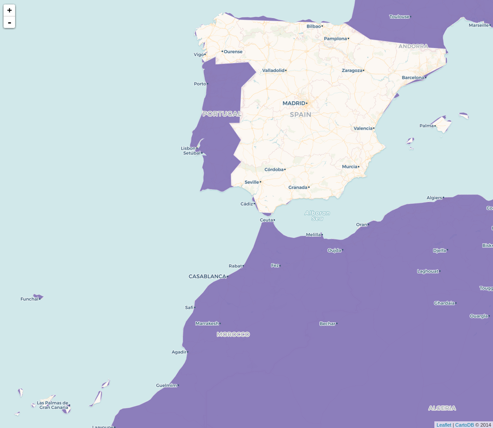
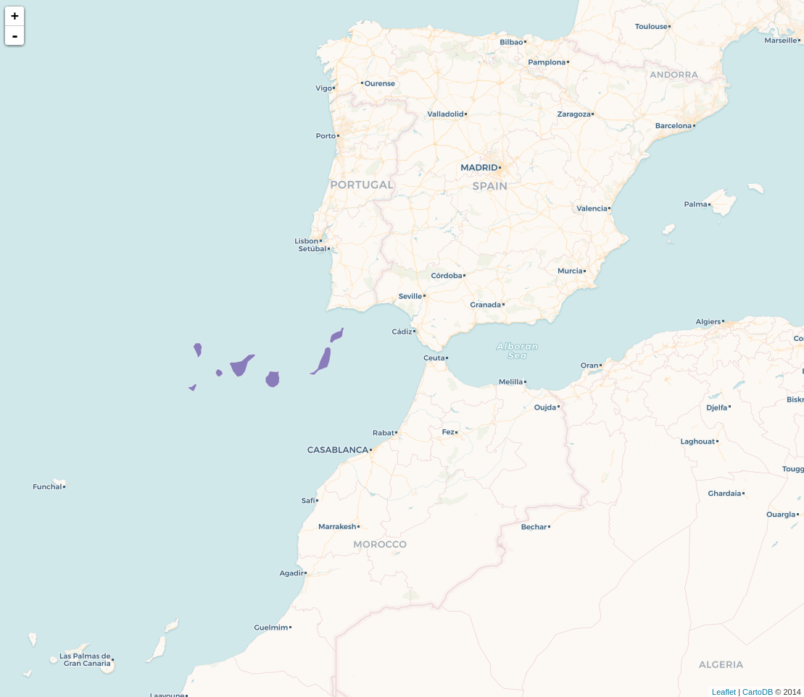
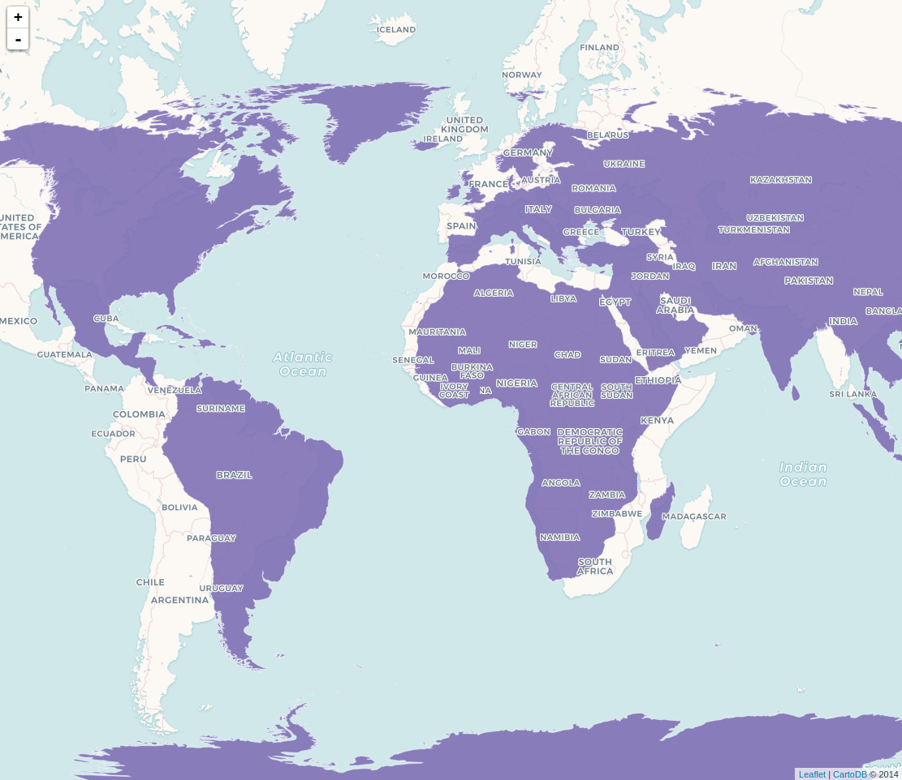
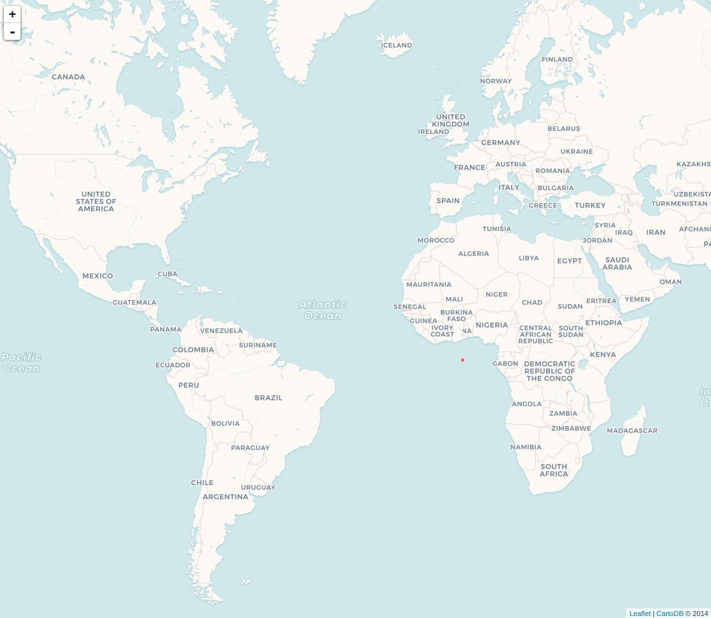
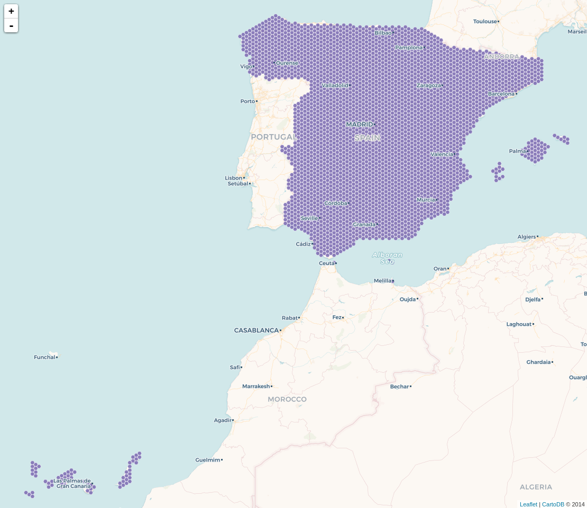
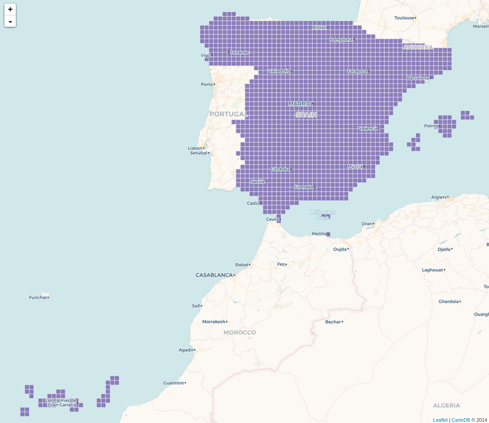

# How to visualize spatial queries with CARTO

1. Go to [CARTO Basic Viewer](http://bit.ly/carto-viewer) application.
2. Copy and paste the following queries within the SQL console and click `CTRL+S`.


## Index

* [Making lines](#lines)
* [Creating areas of influence](#aoi)
* [Getting the closest points](#closest)
* [Intersecting](#intersect)
* [Points within a certain distance](#within)
* [Clipping](#clip)
* [Traslating](#translate)
* [Changing projections](#proj)
* [Great circles](#gc)
* [CARTO spatial functions](#carto)


### Making lines<a name="lines"></a>

#### Simple lines

```sql
WITH 
  b as (SELECT * FROM populated_places WHERE name ilike 'barcelona' and adm0name ilike 'spain'),
  m as (SELECT * FROM populated_places WHERE name ilike 'madrid')

SELECT
  ST_Transform(ST_MakeLine(b.the_geom, m.the_geom),3857) as the_geom_webmercator,
  b.cartodb_id
FROM
  b, m
```


#### Multiple lines

```sql
WITH 
  spain as (SELECT * FROM populated_places WHERE adm0name ILIKE 'spain'),
  madrid as (SELECT * FROM spain WHERE name ILIKE 'Madrid')

SELECT
  ST_Transform(ST_MakeLine(m.the_geom, s.the_geom),3857) as the_geom_webmercator,
  s.cartodb_id
FROM
  spain s, madrid m
WHERE
  s.cartodb_id <> m.cartodb_id
```


#### Sequential lines

```sql
SELECT 
  ST_MakeLine(the_geom_webmercator ORDER BY ST_X(the_geom), ST_Y(the_geom) ASC) as the_geom_webmercator,
  min(cartodb_id) as cartodb_id
FROM
  populated_places
WHERE
  adm0name ILIKE 'spain'
```


### Creating areas of influence<a name="aoi"></a>

#### Simple buffer

```sql
SELECT
  ST_Transform(
    ST_Buffer(
      the_geom::geography,
      10000*5
    )::geometry,
  3857) As the_geom_webmercator,
  1 as cartodb_id
FROM 
  populated_places
WHERE 
  adm0name ILIKE 'spain'
```


```sql
SELECT
  ST_Transform(
    ST_Buffer(
      the_geom::geography,
      10000*5
    )::geometry,
  3857) As the_geom_webmercator,
  1 as cartodb_id
FROM 
  populated_places
WHERE 
  name ILIKE 'madrid'

  UNION ALL

SELECT
  ST_Transform(
    ST_Buffer(
      the_geom::geography,
      10000*10
    )::geometry,
    3857) As the_geom_webmercator,
  2 as cartodb_id
FROM
  populated_places
WHERE 
  name ILIKE 'madrid'
```


#### Negative buffer

```sql
SELECT 
  cartodb_id,
  ST_Transform(
    ST_Buffer(
      the_geom::geography,
      -10000
    )::geometry,
  3857) As the_geom_webmercator
FROM
  world_borders
WHERE
  name ilike 'spain'
```


### Getting the closest points<a name="aoi"></a>

```sql
WITH m as (SELECT * FROM populated_places WHERE name ILIKE 'madrid')

SELECT 
  p.* 
FROM 
  populated_places p, m
WHERE
  m.cartodb_id <> p.cartodb_id
ORDER BY 
  p.the_geom <-> m.the_geom /* ST_Distance(m.the_geom, p.the_geom) */
LIMIT 20
```


You can read more about finding nearest neighbor [here](https://carto.com/blog/nearest-neighbor-joins/) and [here](https://carto.com/blog/lateral-joins/).

```sql
SELECT 
  b.cartodb_id,
  b.the_geom_webmercator
FROM
  populated_places a,
  populated_places b
WHERE
  ST_DWithin(a.the_geom_webmercator,b.the_geom_webmercator,1000000)
AND 
  a.name ILIKE 'madrid'
AND 
  a.cartodb_id <> b.cartodb_id
```


### Intersecting<a name="intersect"></a>

#### Points intersecting polygons

```sql
SELECT
  p.*
FROM
  populated_places p, world_borders w
WHERE
  w.name ILIKE 'spain'
AND
  ST_Intersects(w.the_geom, p.the_geom)
```


#### Aggregating points within polygons

```sql
SELECT
  w.cartodb_id,
  w.the_geom_webmercator,
  count(p.*)/ST_Area(w.the_geom) as cities_density,
  sum(p.pop_max)/ST_Area(w.the_geom) as pop_density
FROM
  populated_places p, world_borders w
WHERE
  ST_Intersects(w.the_geom, p.the_geom)
GROUP BY 1, 2
```

You can change the style to create a choropleth based on cities or population density. Replacing `polygon-fill: #826DBA;` with `polygon-fill: ramp([pop_density], cartocolor(Sunset), quantiles);` should do the trick.


### Clipping<a name="clip"></a>

#### Simple clipping

```sql
SELECT
  a.cartodb_id,
  ST_Difference(
    a.the_geom_webmercator,
    b.the_geom_webmercator
  ) as the_geom_webmercator
FROM
  ne_50m_land a,
  world_borders b
WHERE
  b.name ILIKE 'spain'
```



#### Donnuts

```sql
WITH 
  a as (
    SELECT
      ST_Transform(ST_Buffer(the_geom::geography,10000*5)::geometry, 3857) As the_geom_webmercator,
      cartodb_id
    FROM
      populated_places
    WHERE 
      name ILIKE 'madrid'),

  b as (
    SELECT
      ST_Transform(ST_Buffer(the_geom::geography,10000*10)::geometry, 3857) As the_geom_webmercator,
      cartodb_id
    FROM
      populated_places
    WHERE 
      name ILIKE 'madrid')

SELECT 
  b.cartodb_id,
  ST_Difference(
    b.the_geom_webmercator,
    a.the_geom_webmercator
  ) as the_geom_webmercator
FROM
  a, b
```


You can read more about how to ring buffers with several distances [here](https://bl.ocks.org/jsanz/4564f98c197106432f1b8bf8c9d0230e).


### Traslating<a name="translate"></a>

```sql
SELECT
  cartodb_id,
  ST_Transform(ST_Translate(the_geom,5.0,7.4), 3857) as the_geom_webmercator
FROM
  ne_50m_land
WHERE 
 ST_Intersects(
   the_geom, 
   ST_MakeEnvelope(-18.748169,27.571591,-13.342896,29.463514,4326)
 )
```




### Changing projections<a name="proj"></a>

#### World Robinson

```sql
SELECT
  cartodb_id, 
  ST_Transform(the_geom, 54030) AS the_geom_webmercator
FROM
  ne_50m_land
```



You can read more about how to change map projections in CARTO [here](https://carto.com/blog/free-your-maps-web-mercator/). In addition, you can check and play with map projections [here](https://ramiroaznar.github.io/labs-carto-proj/) and [here](https://bl.ocks.org/ramiroaznar/6d19c773bb2764837c285c89da984c1d).


### Great circles<a name="gc"></a>

```sql
WITH 
  spain as (SELECT * FROM populated_places WHERE adm0name ILIKE 'spain'),
  madrid as (SELECT * FROM spain WHERE name ILIKE 'Madrid')

SELECT 
  ST_Transform(
    ST_Segmentize(
      ST_Makeline(
        m.the_geom, 
        s.the_geom
      )::geography, 
      100000
    )::geometry,
    3857
  ) as the_geom_webmercator,
  s.cartodb_id
FROM 
  spain s, madrid m
WHERE 
  m.cartodb_id <> s.cartodb_id
```


You can read more about making great circles [here](https://carto.com/blog/jets-and-datelines/).


### CARTO spatial functions<a name="carto"></a>

#### CDB_LatLng()

```sql
SELECT 
  1 as cartodb_id,
  ST_Transform(CDB_LatLng(0, 0), 3857) as the_geom_webmercator  /* ST_SetSRID(ST_MakePoint(0, 0), 4326) */
```



#### Grids

```sql
WITH grid as (
  SELECT
    row_number() over () as cartodb_id,
    CDB_HexagonGrid(
      ST_Buffer(the_geom_webmercator, 1000000),
      10000
    ) AS the_geom_webmercator
  FROM
    world_borders
  WHERE
    name ILIKE 'spain')

SELECT
  grid.the_geom_webmercator,
  grid.cartodb_id
FROM
  grid, world_borders a
WHERE
  ST_Intersects(grid.the_geom_webmercator, a.the_geom_webmercator)
AND 
  name ILIKE 'spain'
```



```sql
WITH grid as (
  SELECT
    row_number() over () as cartodb_id,
    CDB_RectangleGrid(
      ST_Buffer(the_geom_webmercator, 1000000),
      25000,
      25000
    ) AS the_geom_webmercator
  FROM
    world_borders
  WHERE
    name ILIKE 'spain')

SELECT
  grid.the_geom_webmercator,
  grid.cartodb_id
FROM
  grid, world_borders a
WHERE
  ST_Intersects(grid.the_geom_webmercator, a.the_geom_webmercator)
AND 
  name ILIKE 'spain'
```

