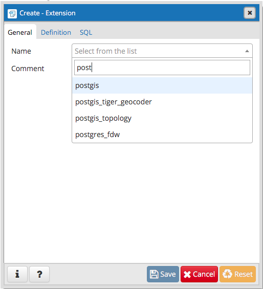
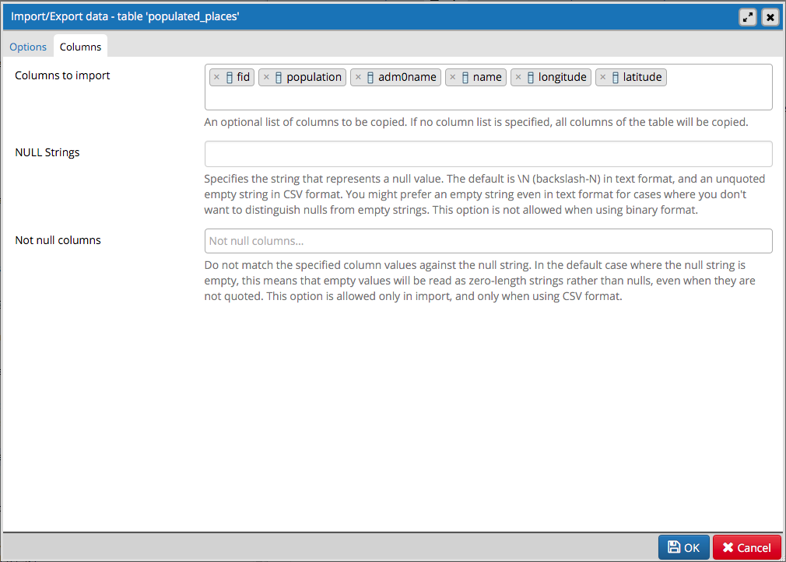

# Introduction to pgAdmin 4

## What's pgAdmin? 

pgAdmin is a client application for PostgreSQL that works as a graphical interface for querying and managing our PostgreSQL database server. 

It's an Open Source community project, actively developed and maintained by the [pgAdmin Development Team](https://www.pgadmin.org/development/team/). There are versions for Linux, macOS and Windows, and more recently, also Python Wheel and Docker

There is plenty of information at the [official website](https://www.pgadmin.org), and also: 

* [Documentation](https://www.pgadmin.org/docs/)
* [Mailing list](https://www.pgadmin.org/support/list/)
* [Download](https://www.pgadmin.org/download/)


## What can we do with it? 

**pgAdmin** allows connecting to local and remote PostgreSQL servers, creating new databases and fully manage them: 

* Create, alter, drop relations
* Query data
* Update and Insert new data
* Execute SQL queries
* Create extensions, roles, sequences, triggers, etc

## Let's practice

### Creating a new conection

* Create a server, you will need to specify: 

	* Name
	* host
	* port
	* user
	* password

depending on the parameters used when you installed the database.


* After the connection is succesful, we'll be able to see something like this: 


### Creating a new database

Once connected to our PostgreSQL server, we can create a new database


On the _SQL_ tab you can see the actual SQL query that's executed to create the database with those parameters:

```sql
CREATE DATABASE geodb
    WITH 
    OWNER = postgres
    ENCODING = 'UTF8'
    CONNECTION LIMIT = -1;

COMMENT ON DATABASE geodb
    IS 'A database with geospatial capability';
```


### Making it spatial

Adding geospatial capabilities requires adding the PostGIS extension. Assuming the extension is already installed on your PostgreSQL server, the only thing we need to do is activating it for this database. 
There are other extensions included with PostGIS, but for the sake of this workshop, we'll keep it simple and add only `postgis`.

That's done through the `CREATE EXTENSION` command, or using pgAdmin interface:



```sql
CREATE EXTENSION postgis
    SCHEMA public
    VERSION "2.3.1";
```

Let's check that we have indeed added spatial capabilities to our database. Let's open the _Query Tool_ and type: 

```sql
SELECT ST_Point(44.5, -3.50)
```


We'll see more complex examples of geospatial queries later today, so let's continue. 


### Creating a new table and populating it from a file

* Download the [file](http://ernestomb.carto.com/api/v2/sql?q=SELECT%20fid%2C%20pop_max%20as%20population%2C%20adm0name%2C%20name%2C%20longitude%2C%20latitude%20FROM%20ernestomb.ne_10m_populated_places_simple_1&format=csv&filename=populated_places)

* Inspect the file content to see the data structure and which data types we'll need for our table:


`| fid | population | adm0name | name | longitude | latitude |`

* Create empty table in pgAdmin to hold the data. 
	* In PostgreSQL, tables are organized in `schemas`. This is also common to other databases, but not universal
	
	* We'll need to manually create each column and define the data type before importing the data from the `csv` file. 
	
* Use the _Import/Export_ tool to copy data from the file to the table in your database.

  

  We need to pay attention to the delimiter, quoting and `NULL` strings and whether our file contains headers or not. 

  Another important point here is the default encoding of the database, which is defined during the installation, and the encoding of the file. [More info](https://makandracards.com/makandra/18643-how-to-change-the-locale-of-a-postgresql-cluster)

  It's also important to take into account the order of the columns. It should be the same as in the CSV file

  

This operation could also be performed with: 

```sql
COPY populated_places(fid, population, adm0name, name, longitude, latitude) FROM '/path/to/file/populated_places.csv' DELIMITERS ',' CSV HEADER;
```

Let's check that our data is actually there. Open the _Query Tool_ and type: 

```sql
SELECT * FROM populated_places;
```


So, we already have a table with some data, but we're still not using any geo capability. Let's create Point geometries from our `longitude` and `latitude` columns:

* Add a column of type `geometry`, called `the_geom`. Get more information about geospatial data types [here](https://github.com/CartoDB/carto-workshop/blob/master/04-database/exercises/sql-spatial.md#postgis-concepts-geometry-vs-geography)


or

```sql
ALTER TABLE public.populated_places
    ADD COLUMN the_geom geometry;
```

* Populate it from `longitude` and `latitude` values with `ST_MakePoint()`. Open _Query Tools_ and type:

```sql
UPDATE populated_places
SET the_geom = ST_SetSRID(
	ST_MakePoint(
		longitude,
		latitude
		),4326
	)
```

it should return:

```
UPDATE 7322

Query returned successfully in 137 msec.
```


Let's check what `the_geom` contains now:

```sql
SELECT ST_AsText(the_geom) FROM populated_places
```


There are many ways to create points from coordinates on separate columns, there is some discussion [here](https://gis.stackexchange.com/questions/58605/which-function-for-creating-a-point-in-postgis)


At this point we have a PostgreSQL database with the PostGIS extension enabled. Our `populated_places` table should have a `the_geom` column containing geometries that we can query. 


