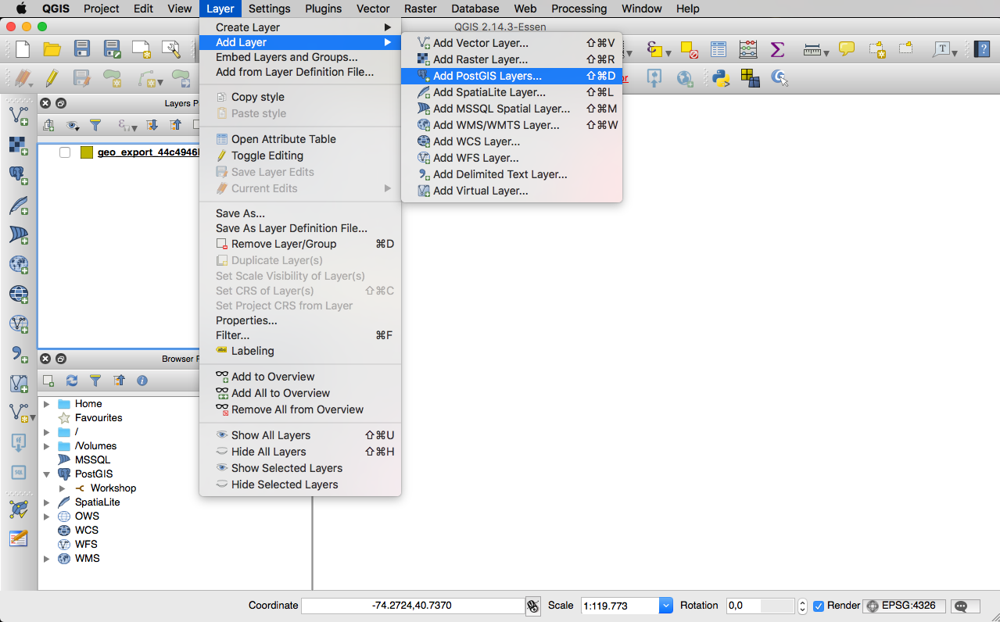
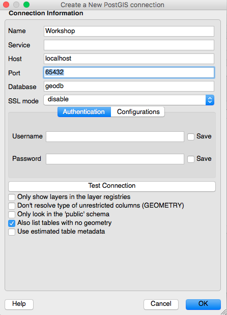
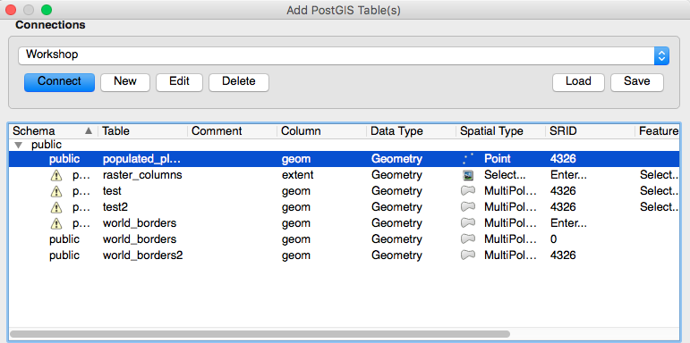
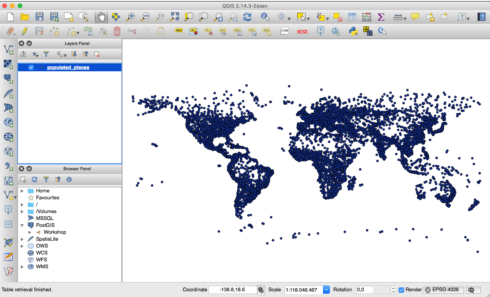
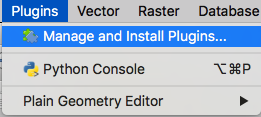
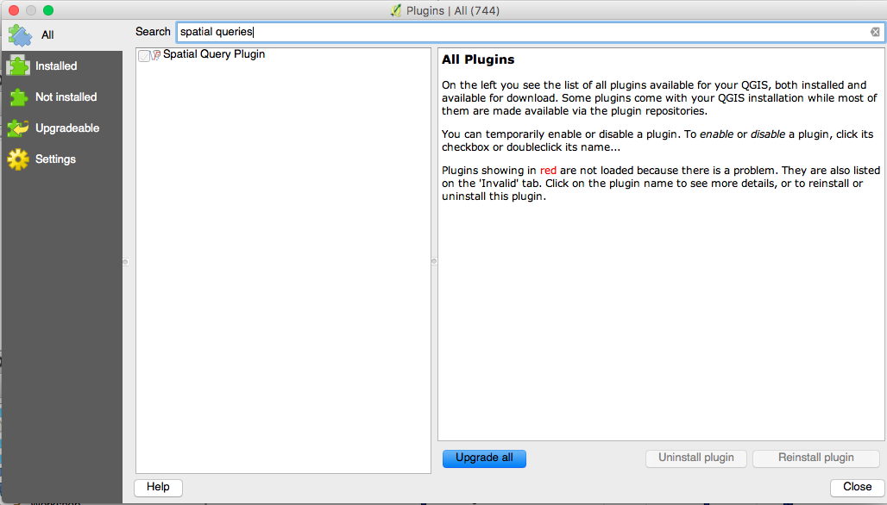
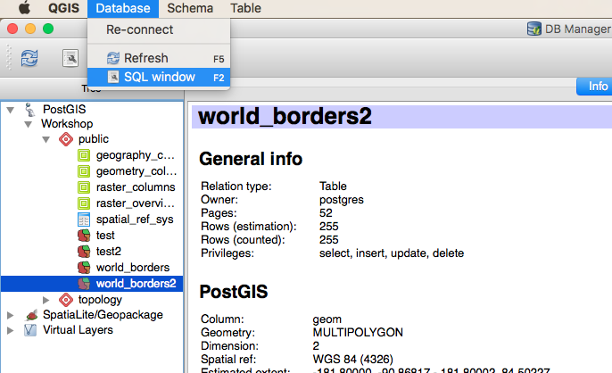
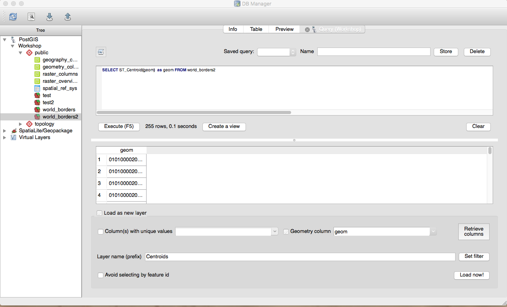
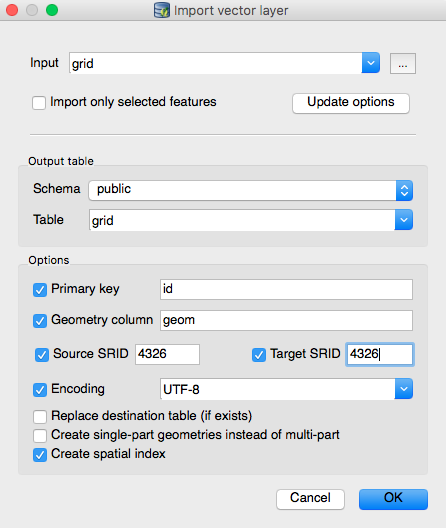

## Quick introduction to QGIS

QGIS is an open source GIS Desktop software that allow to create, visualize, analyze and publish geospatial information. It can be downloaded for free from [htier webpage](http://www.qgis.org/en/site/).

Im [this section](https://docs.qgis.org/2.0/en/docs/user_manual/introduction/qgis_gui.html) of the documentation of QGIS you can find detailed information about the different options of the QGIS UI.

In [this workshop](https://github.com/GeoinquietosMadrid/intro-qgis) of Geoinquietos you can find an Introductory workshop to QGIS.

## Connect QGIS to a PostgreSQL/PostGIS database

In order to connect QGIS to a database we will use the option `Layer -> Add PostGIS layer` 



Then, a new menu will appear and we will need to set the paramaters to enable to connection between the database and QGIS



### Adding layers from database to QGIS





If we don't want to load all the data of the layer we can add a filter to our data by clicking on the option  `Set Filter`, this option will open a new menu where we can select a condition to filter our data.

We can use different plugins of QGIS to apply spatial queries to the tables of our database and display the result on QGIS:

* Spatial queries
* DBManager

Installing a plugin to QGIS by selecting using the PLugins manager:





## Spatial queries with QGIS using DBManager






* Centroids: `SELECT ST_Centroid(geom) as geom FROM world_borders2`

* Buffers filtered: `ST_Buffer(ST_Centroid(geom)::geography, 500000)::geometry as geom, admin FROM world_borders2 + SET filter to admin= 'Spain'`

*  Gridding a geometry using PostGIS

We can apply the next SQL query to create a grid using PostGIS:

```sql
WITH usext AS (
    SELECT
        ST_SetSRID(CAST(ST_EXTENT(geom) AS geometry), 4326) as geom_ext, 
        60 as x_gridcnt,
        40 as y_gridcnt
    FROM world_borders2
    WHERE admin = 'United States of America'
),

grid_dim AS (
    SELECT (
            ST_XMax(geom_ext) - ST_XMin(geom_ext)
        ) / x_gridcnt AS g_width,
        ST_XMin(geom_ext) as xmin,
        ST_XMax(geom_ext) as xmax,
        (
            ST_YMax(geom_ext) - ST_YMin(geom_ext)
        ) / y_gridcnt as g_height,
        ST_YMin(geom_ext) as ymin,
        ST_YMax(geom_ext) as ymax
    FROM
        usext
),
grid AS (
    SELECT  
        x, y,
        ST_MakeEnvelope(
            xmin + (x - 1) * g_width,
            ymin + (y - 1) * g_height,
            xmin + x * g_width,
            ymin + y * g_height,
            4326
        ) AS geom
    FROM
        (SELECT generate_series(1, x_gridcnt) FROM usext) as x(x)
        CROSS JOIN
        (SELECT generate_series(1, y_gridcnt) FROM usext) as y(y)
        CROSS JOIN 
        grid_dim
)

SELECT ST_Intersection(grid.geom, world_borders2.geom) as geom from grid, world_borders2
WHERE ST_Intersects(grid.geom, world_borders2.geom) AND world_borders2.admin = 'United States of America'
```

### Importing data from QGIS to database

Open the DBManager and select the option "import layer" to import the layer to the database:




